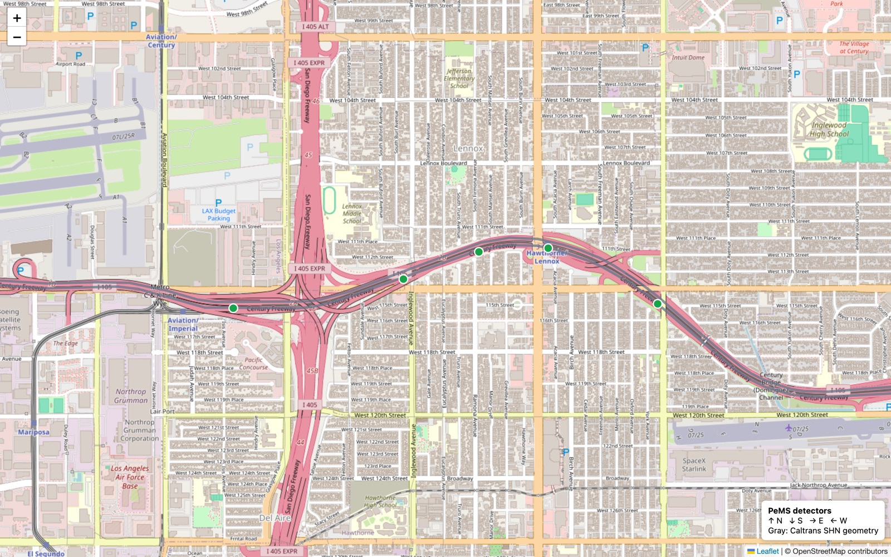

# Caltrans PeMS Data Downloader

[](https://github.com/wcc961129/pems-data-downloader/actions/workflows/ci.yml)
[](pyproject.toml)
[](https://docs.astral.sh/uv/)
[](LICENSE)
[](https://doi.org/10.1016/j.trc.2020.102635)

Download authenticated Caltrans PeMS detector data by region and time range, then export research-ready observations, detector locations, an approximate detector graph, and optional official State Highway Network geometry.

[中文说明](README.zh-CN.md) · [User guide](docs/user-guide.md) · [Data format](docs/data-format.md) · [Real format samples](examples/sample-output/README.md)



The project generated this map from PeMS detector metadata for 2026-07-27 and Caltrans SHN geometry retrieved with the download. Green points are PeMS detectors and gray lines are official road geometry. Every download also produces an interactive `network/map.html`.

## Supported source granularities

The downloader is not limited to five-minute data. It directly consumes two official PeMS Station archives:

| Source | CLI option | PeMS archive unit | Flow column | Latest verified sample |
|---|---|---|---|---|
| Station 5-Minute | `--granularity 5min`, the default | one day per District | `flow_veh_5min` | District 7, 2026-07-27 |
| Station Hour | `--granularity hour` | one month per District | `flow_veh_hour` | District 7, 2026-06 |

The dates above were verified against the live PeMS Clearinghouse on 2026-07-29 and do not imply a permanent publication lag. Hourly observations come from the official hourly archive; the downloader does not derive them by summing five-minute rows.

The Clearinghouse also lists Station Day, AADT, Link, Census, FasTrak, Re-ID, and incident datasets. Their parsers are not implemented yet, so this README does not label them as supported.

## Inspect the format in 30 seconds

Five-minute observations:

```csv
timestamp,station_id,speed_mph,flow_veh_5min,occupancy_fraction,observed_percent,latitude,longitude,freeway,direction,lane_type
2026-07-27T00:00:00-07:00,760063,69.4,159,.0296,0,33.929816,-118.373757,105,E,ML
```

Hourly observations:

```csv
timestamp,station_id,speed_mph,flow_veh_hour,occupancy_fraction,observed_percent,latitude,longitude,freeway,direction,lane_type
2026-06-01T00:00:00-07:00,760063,68.8,1560,.0246,0,33.929816,-118.373757,105,E,ML
```

Detector attributes:

```csv
station_id,freeway,direction,district,county,city,state_postmile,absolute_postmile,latitude,longitude,length,lane_type,lanes,name
760063,105,E,7,37,44000,R1.8,1.8,33.929816,-118.373757,.6,ML,3,IMPERIAL 1
```

Approximate graph edges:

```csv
source_station_id,target_station_id,distance_miles,method
760063,767838,0.700000,same_route_direction_lane_type_postmile_order
```

See the [real format samples](examples/sample-output/README.md) for GeoJSON, manifest, and additional one-row previews. An `observed_percent` value of `0` means no lane points were directly observed and the measurement may be imputed by PeMS. Keep this quality field in downstream analysis.

## Windows, macOS, and Linux

The command names and arguments for `uv sync`,
`uv run playwright install chromium`, and `uv run pems-data ...` are the same
on all three platforms. Installation, shell line continuation, and system
timezone data are the main differences.

| Platform | Current status | Recommended shell | Notes |
|---|---|---|---|
| macOS | Verified with a live run | Terminal with Zsh/Bash | Bash examples work as written |
| Linux | Ubuntu CI covers Python 3.10–3.12 | Bash | `auth` needs an environment capable of displaying a browser |
| Windows | Windows CI is configured for Python 3.12 | PowerShell | uv installs conditional `tzdata`; `0600` does not have Unix semantics |

### macOS / Linux

```bash
curl -LsSf https://astral.sh/uv/install.sh | sh
git clone https://github.com/wcc961129/pems-data-downloader.git
cd pems-data-downloader
uv sync --locked
uv run playwright install chromium
uv run pems-data auth
```

If Chromium system libraries are missing on Linux, use:

```bash
uv run playwright install --with-deps chromium
```

### Windows PowerShell

```powershell
powershell -ExecutionPolicy ByPass -c "irm https://astral.sh/uv/install.ps1 | iex"
git clone https://github.com/wcc961129/pems-data-downloader.git
Set-Location pems-data-downloader
uv sync --locked
uv run playwright install chromium
uv run pems-data auth
```

The code uses the `America/Los_Angeles` IANA timezone. Windows normally has no
system IANA timezone database, so `uv sync --locked` installs `tzdata` through
a conditional dependency. CI is configured for Ubuntu, macOS, and Windows.

The remaining README examples use the Bash/Zsh backslash `\` for line
continuation. In PowerShell, use a backtick `` ` ``:

```powershell
uv run pems-data fetch `
  --granularity 5min `
  --district 7 `
  --start 2026-07-27T00:00 `
  --end 2026-07-27T00:10 `
  --station-id 760063,760074,760080,767838,773656 `
  --with-road-network `
  --output data\i105-5min
```

You can also put the complete command on one line on any platform.
`--granularity`, time, District, and region selectors do not change by
operating system. See the official
[uv installation guide](https://docs.astral.sh/uv/getting-started/installation/)
and [Playwright browser guide](https://playwright.dev/python/docs/browsers).

## Quick start with uv

After platform-specific setup and authentication, check the environment and
discover actual data availability:

```bash
uv run pems-data doctor
uv run pems-data latest --district 7
uv run pems-data stations \
  --district 7 \
  --date 2026-07-27 \
  --freeway 105 \
  --direction E \
  --lane-type ML \
  --limit 5
```

`latest` removes date guesswork and `stations` removes station-ID guesswork.
See the [user guide](docs/user-guide.md) for the complete flow.

Download five detectors at five-minute granularity and include official road geometry:

```bash
uv run pems-data fetch \
  --granularity 5min \
  --district 7 \
  --start 2026-07-27T00:00 \
  --end 2026-07-27T00:10 \
  --station-id 760063,760074,760080,767838,773656 \
  --with-road-network \
  --output data/i105-5min
```

Download official hourly observations for the same detectors:

```bash
uv run pems-data fetch \
  --granularity hour \
  --district 7 \
  --start 2026-06-01T00:00 \
  --end 2026-06-01T02:00 \
  --station-id 760063,760074,760080,767838,773656 \
  --output data/i105-hour
```

Main output structure:

```text
data/i105-5min/
├── manifest.json
├── filtered/
│   └── station_5min.csv.gz
├── processed/
│   ├── observations.csv.gz
│   ├── stations.csv
│   ├── detectors.geojson
│   └── edges.csv
└── network/
    ├── caltrans_shn.geojson
    └── map.html
```

Hourly downloads use `filtered/station_hour.csv.gz`; other paths remain unchanged. See the [user guide](docs/user-guide.md) for bounding-box, freeway, direction, lane-type, county, and GE-GAN profile examples.

## Before a larger download

- A short five-minute request still transfers its complete daily archive; an hourly request still transfers its complete monthly archive.
- Raw archives are deleted by default. Use `--keep-raw` only when source-level review is necessary.
- Validate a few stations and timestamps before scaling up to catch station, timezone, and quality issues early.
- Metadata preflight runs before traffic downloads. Zero stations stop early; zero observations fail unless `--allow-empty` is explicit.
- `edges.csv` is a transparent postmile-neighbor approximation, not official Caltrans topology.
- Preserve `manifest.json` with experiment results because it records source files, metadata, row counts, granularity, and generated artifacts.

## GE-GAN research profile

This project grew from the data acquisition work behind:

> Dongwei Xu, Chenchen Wei, Peng Peng, Qi Xuan, and Haifeng Guo.  
> **GE-GAN: A novel deep learning framework for road traffic state estimation.**  
> *Transportation Research Part C: Emerging Technologies*, 117, 102635, 2020.

[Paper](https://doi.org/10.1016/j.trc.2020.102635) · [Official open-source code](https://github.com/wcc961129/GE-GAN)

```bash
uv run pems-data fetch \
  --profile ge-gan-d7-2014 \
  --output data/ge-gan-d7-2014
```

The profile uses five-minute data to prepare the published PeMS source period and detector set. It does not claim bit-for-bit reproduction of every paper preprocessing step. Read the [GE-GAN reproducibility notes](docs/ge-gan.md).

## Research-use notice

This software is intended for research and education. It is not validated for operational traffic control, safety-critical decisions, or real-time incident response. The code is MIT-licensed; downloaded PeMS and Caltrans GIS data remain subject to their source terms and attribution requirements. Read [DISCLAIMER.md](DISCLAIMER.md).

## Documentation

- [User guide](docs/user-guide.md)
- [Data format, units, and quality fields](docs/data-format.md)
- [Official road geometry and approximate graph boundary](docs/road-network.md)
- [Hourly support implementation report](docs/station-hour-support/implementation-report.md)
- [User-journey optimization report](docs/usability-optimization/implementation-report.md)
- [Architecture](docs/architecture.md)
- [Development with uv](docs/development.md)
- [Traffic forecasting baseline repository proposal](docs/model-repository-roadmap.md)
- [Contributing](CONTRIBUTING.md)
