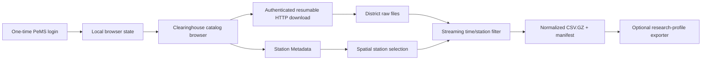

# Architecture

The project separates volatile website behavior from stable local data processing.

## Modules

- `browser.py`: login and catalog interaction.
- `http.py`: authenticated transfer, `.part` files, HTTP Range, and HTML-response rejection.
- `planner.py`: Pacific-time parsing and Clearinghouse filename contracts.
- `metadata.py`: bounding-box and station-attribute selection.
- `filtering.py`: streaming long-format output.
- `profiles.py`: sourced, immutable research configurations.
- `exporters.py`: model- or paper-specific output adapters.

New PeMS dataset types should add a planner and schema rather than adding conditionals to the station-five-minute parser.

